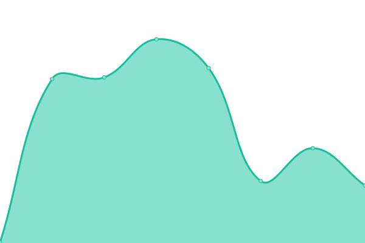
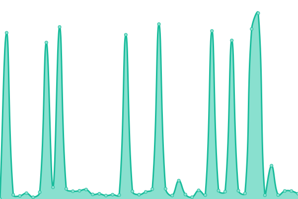
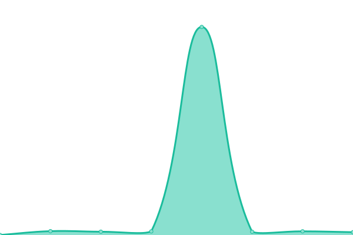
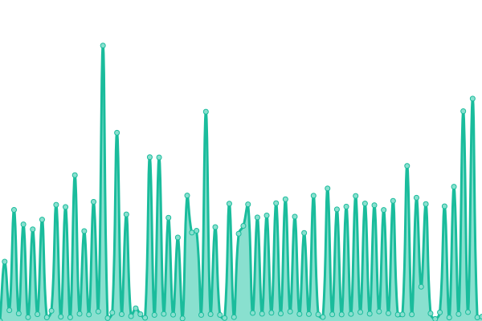

# [📈 Live Status](https://upptime.github.io/upptime): <!--live status--> **🟧 Partial outage**

This repository contains the open-source uptime monitor and status page for [Upptime](https://upptime.js.org), powered by [Upptime](https://github.com/upptime/upptime).

With [Upptime](https://upptime.js.org), you can get your own unlimited and free uptime monitor and status page, powered entirely by a GitHub repository. We use [Issues](https://github.com/upptime/upptime/issues) as incident reports, [Actions](https://github.com/Syrup/upl/actions) as uptime monitors, and [Pages](https://upptime.github.io/upptime) for the status page.

<!--start: status pages-->
<!-- This summary is generated by Upptime (https://github.com/upptime/upptime) -->
<!-- Do not edit this manually, your changes will be overwritten -->
<!-- prettier-ignore -->
| URL | Status | History | Response Time | Uptime |
| --- | ------ | ------- | ------------- | ------ |
|  [MarkdownIt Template](https://markdown-it-template.mioun.repl.co/) | 🟩 Up | [markdown-it-template.yml](https://github.com/Miouwn/upl/commits/HEAD/history/markdown-it-template.yml) | 

 615ms
     
 | 

<a href="https://Miouwn.github.io/upl/history/markdown-it-template">0.08%</a>
    

|  [For School](https://for-school.mioun.repl.co/) | 🟩 Up | [for-school.yml](https://github.com/Miouwn/upl/commits/HEAD/history/for-school.yml) | 

 329ms
     
 | 

<a href="https://Miouwn.github.io/upl/history/for-school">0.00%</a>
    

|  [Uptime Kuma](https://uptime-last.mioun.repl.co/) | 🟥 Down | [uptime-kuma.yml](https://github.com/Miouwn/upl/commits/HEAD/history/uptime-kuma.yml) | 

 0ms
     
 | 

<a href="https://Miouwn.github.io/upl/history/uptime-kuma">0.00%</a>
    

|  [Dcb](https://dcbot.mioun.repl.co/) | 🟩 Up | [dcb.yml](https://github.com/Miouwn/upl/commits/HEAD/history/dcb.yml) | 

 348ms
     
 | 

<a href="https://Miouwn.github.io/upl/history/dcb">0.08%</a>
    

|  Lavalink | 🟥 Down | [lavalink.yml](https://github.com/Miouwn/upl/commits/HEAD/history/lavalink.yml) | 

 0ms
     
 | 

<a href="https://Miouwn.github.io/upl/history/lavalink">0.00%</a>
    

|  Ye | 🟥 Down | [ye.yml](https://github.com/Miouwn/upl/commits/HEAD/history/ye.yml) | 

 526ms
     
 | 

<a href="https://Miouwn.github.io/upl/history/ye">0.00%</a>
    

<!--end: status pages-->

[**Visit our status website →**](https://upptime.github.io/upptime)

## 📄 License

- Powered by: [Upptime](https://github.com/upptime/upptime)
- Code: [MIT](./LICENSE) © [Upptime](https://upptime.js.org)
- Data in the `./history` directory: [Open Database License](https://opendatacommons.org/licenses/odbl/1-0/)
